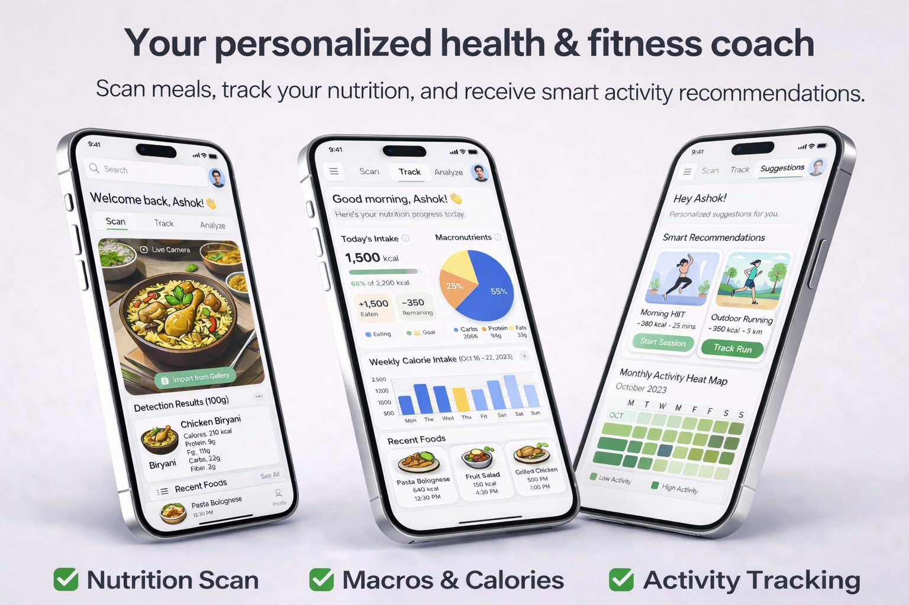
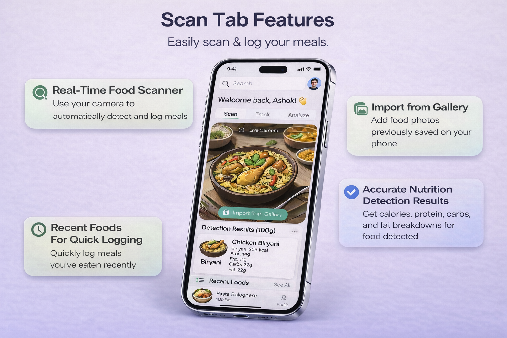
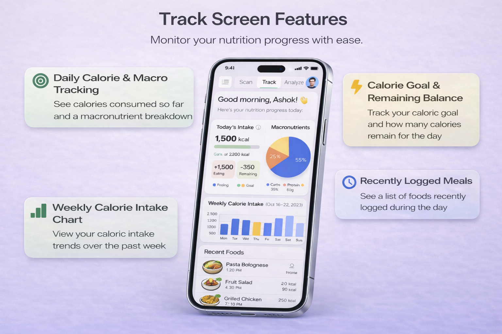
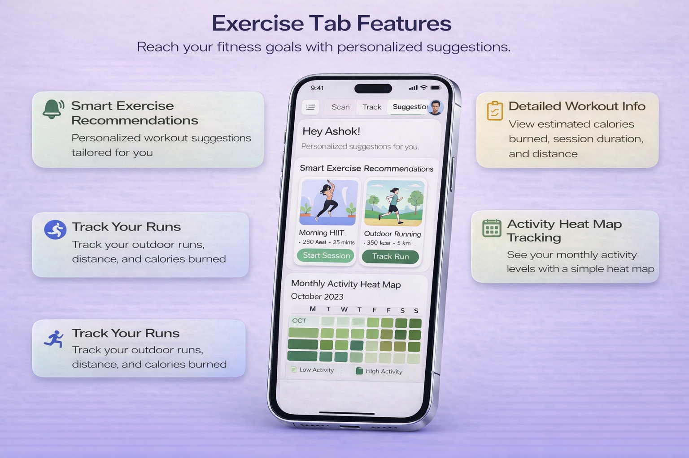

# **Nutrivision: AI Diet & Fitness Tracker**

> Ditch the guesswork and manual logging. Point your camera at any meal, and our smart AI instantly scans and calculates your exact macros for effortless daily tracking.
>
> Visualize your nutritional trends through beautiful charts, then crush personalized workouts tailored precisely to the food you eat. Transform your daily fitness journey!

---

## **Key Features**

### 📸 **Scan Tab**

* **Real-Time AI Detection:** Instantly identifies food via the live camera feed, completely eliminating any manual typing effort needed.
* **Retrospective Photo Logging:** Analyzes device gallery photos to easily log past meals that were eaten offline earlier today.
* **Instant Macro Extraction:** Extracts exact macronutrients immediately upon scanning to strongly support your specific dietary goal tracking needs.
* **Standardized Density Baseline:** Calculates detailed nutrition profiles per hundred grams to allow for incredibly easy food calorie comparisons.
* **Seamless Diary Entry:** Automatically prepares your newly identified foods for instant and effortless daily dietary diary logging purposes.

### 📊 **Track Tab**

* **Monthly Macro Trends:** Aggregates your monthly macronutrient ratios visually to ensure steady long term dietary consistency and balance.
* **Weekly Caloric Pacing:** Tracks daily calorie fluctuations across the week to help dynamically adjust ongoing food intake levels.
* **Timestamped Dietary Logging:** Records exact meal consumption times accurately to help analyze your personal daily hunger pattern trends.
* **Historical Data Auditing:** Toggles seamlessly between past weeks and months to effectively evaluate your ongoing personal health progress.
* **Granular Intake Accountability:** Breaks down total daily energy intake by specific items to pinpoint exact dietary goal impacts.

### 🏋️ **Exercise Tab**

* **Diet-Adapted Recommendations:** Suggests specific workout routines automatically based entirely upon your recently logged nutritional and caloric data.
* **Schedule-Based Selection:** Offers convenient preset workout routines categorized by strict durations for fitting into tight daily schedules.
* **Skill-Level Matching:** Filters all workout difficulty levels seamlessly to correctly match your current personal physical fitness capacity.
* **Weekly Volume Tracking:** Accumulates total active workout minutes accurately to ensure you hit standard weekly physical activity targets.
* **Gamified Consistency Heatmap:** Logs daily physical activities into persistent monthly records to heavily encourage building continuous workout streaks.

---

## **Tech Stack**

* **Python:** Powers the core backend logic and serves as the primary engine for running your AI food recognition models.
* **OpenCV:** Captures and processes the live camera feed, preparing the image data so the AI can accurately identify the food in real-time.
* **FastAPI:** Creates a lightning-fast backend API to rapidly receive scanned images from the user and instantly return the calculated nutritional facts.
* **HTML/CSS/JS:** Forms the essential web-based foundation of the application, handling the core markup, base styling, and native browser interactions.
* **React:** Builds the dynamic, multi-tab user interface (Scan, Track, Exercise), ensuring seamless navigation and instant updates when logging daily calories.
* **TailwindCSS:** Rapidly styles your modern UI elements, effortlessly handling the vibrant gradient backgrounds, pastel charts, and custom card layouts without writing complex CSS files.

---