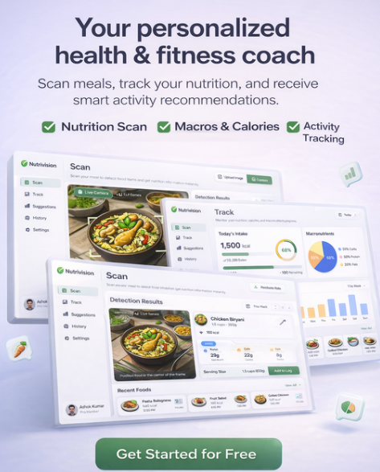
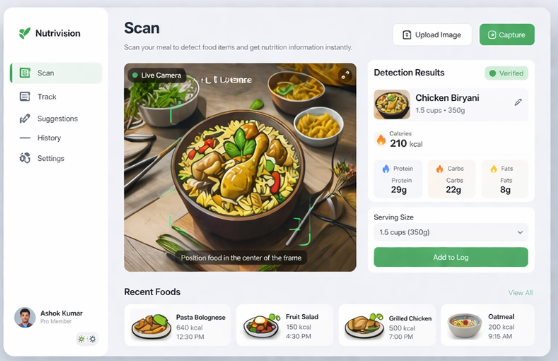
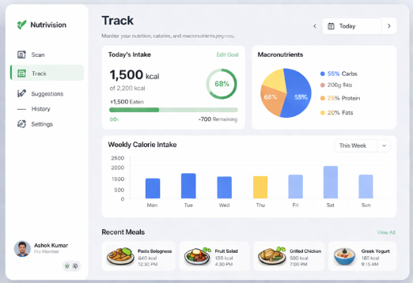
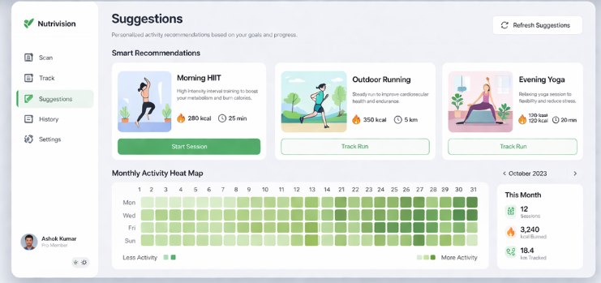

# **Nutrivision: Desktop AI Diet & Fitness Tracker**

> Ditch the guesswork and manual logging. Launch Nutrivision on your desktop, hold any meal up to your webcam, and let our smart AI instantly calculate your exact macros. 
>
> Visualize your nutritional trends and get personalized workout recommendations right from your computer, all powered by a lightweight, native Python application.




---

## **Tech Stack Explained**

This version of Nutrivision is built entirely as a native desktop application, utilizing a streamlined, Python-only stack:

* **Python (The Core Engine):** Serves as the central nervous system of the application. It handles all the backend logic, mathematical macro calculations, data storage (saving your daily logs to local files), and coordinates the AI inference to identify the food.
* **OpenCV (The Vision System):** The powerhouse for all image processing. It hooks directly into your computer's webcam to capture live video feeds, applies necessary filters or resizing, and draws the visual bounding boxes and scanning animations over your food in real-time.
* **Tkinter (The User Interface):** Python's standard GUI (Graphical User Interface) library. It is used to build the actual application window, including the `ttk.Notebook` for the multi-tab navigation (Scan, Track, Exercise), the buttons to capture images, and the canvas elements to display the live OpenCV video feed and your daily calorie charts.

---

## **Key Features by Tab**

### 📸 **Scan Tab (Powered by OpenCV & Tkinter Canvas)**
* **Live Webcam Feed:** Integrates your computer's webcam directly into the application window for real-time viewing.
* **Local Image Upload:** Includes a file dialogue button to browse and upload meal photos saved on your hard drive.
* **Instant Macro Extraction:** Displays calculated calories, protein, carbs, and fats instantly upon capturing the image.
* **One-Click Logging:** Saves the identified food and its nutritional profile directly to your local daily log.



### 📊 **Track Dashboard (Rendered via Tkinter UI)**
* **Local Data Auditing:** Reads from your locally saved files to track your daily and monthly progress without needing a cloud database.
* **Visual Progress Bars:** Utilizes Tkinter progress bars and canvas shapes to visually represent your daily caloric intake against your goals.
* **Timestamped History:** Maintains a running, scrollable listbox of everything you have eaten today and exactly when you ate it.



### 🏋️ **Exercise Recommendations**
* **Data-Driven Workouts:** Reads your recent caloric intake and suggests specific workout routines to match your energy levels.
* **Target Tracking:** Accumulates your active minutes to ensure you are hitting your weekly desktop-warrior fitness goals.



---

## **Installation & Setup**

### **1. Prerequisites**
Ensure you have Python 3.8+ installed on your machine. You do not need a complex web server for this version.

### **2. Clone and Install Dependencies**
Open your terminal or command prompt and run:
```bash
git clone https://github.com/yourusername/nutrivision-desktop.git
cd nutrivision-desktop

# Create a virtual environment (optional but recommended)
python -m venv venv
source venv/bin/activate  # On Windows use: venv\Scripts\activate

# Install the required computer vision and UI packages
pip install opencv-python pillow
```
*(Note: `pillow` is required to seamlessly convert OpenCV images into a format Tkinter can display).*

### **3. Launch the Application**
Run the main Python script to open the desktop window:
```bash
python main.py
```

---

## **Usage**
1.  Run the application; a native window will open on your desktop.
2.  Navigate to the **Scan** tab. Your webcam indicator should turn on. Hold your food up to the camera and click "Capture," or click "Upload File" to choose an existing image.
3.  Click "Log Meal" to save the calculated macros to your profile.
4.  Switch to the **Track** tab to see your updated daily calorie charts and historical logs.
5.  Check the **Exercise** tab for your dynamically generated daily workout plan.